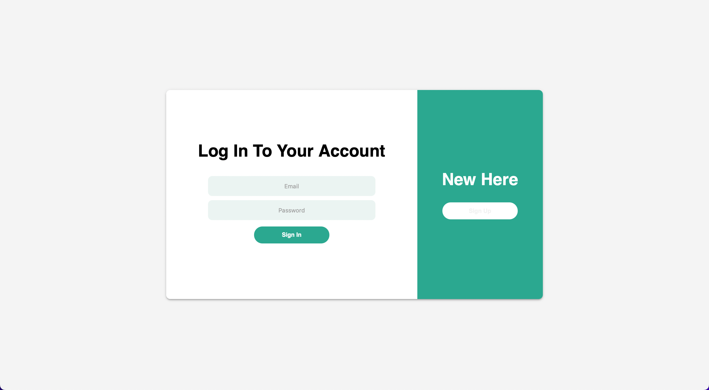
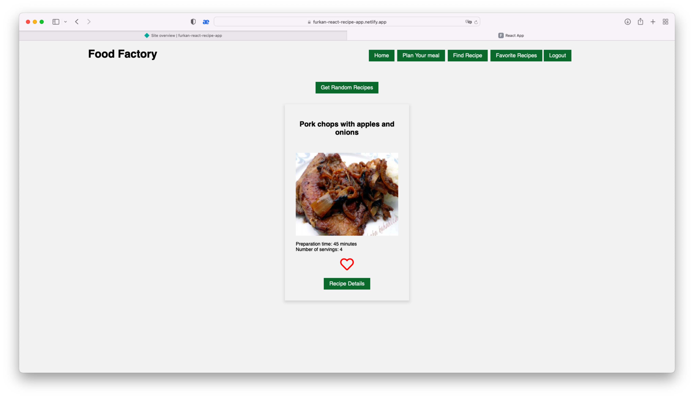
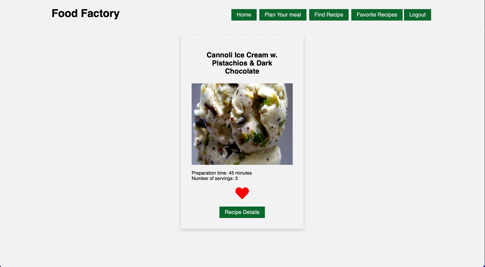
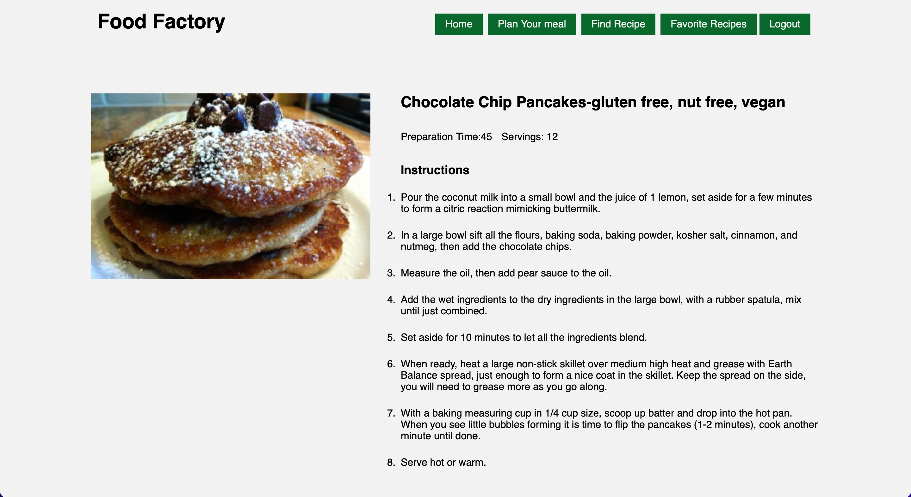
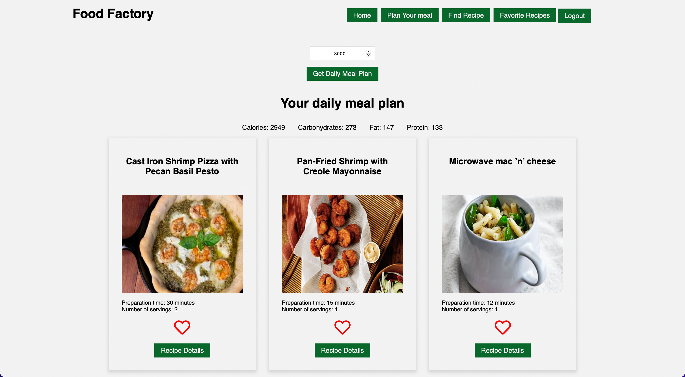
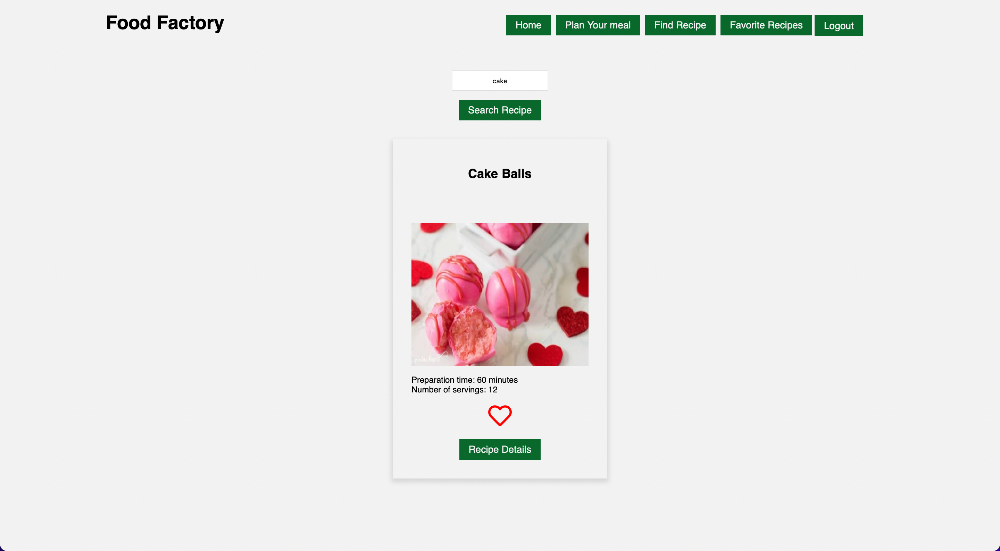

# Food Recipe Application

   

---

## How does application works?

1. To use the application **log in** is required. If the user **didn't sign up**, then **sign up** is required.
   

1. At the home page there is a button named **Get Random Recipe** which renders randomly a recipe from the [recipe api](https://spoonacular.com/food-api/docs#Get-Random-Recipes). _The rendered recipe number can be increased but due to api call limitation, only one render recipe is rendered._
   

   - with _Get Random Recipe_ feature, **per recipe title, image, cooking time and serving number** is rendered. Also below every recipe there is a **like** button and **Recipe Details** button. When clicked **like** button, recipe is stored in **favorite recipes** _which can be reached by clicking **Favorite Recipes** link in the navigation section which is at the top of the page_.

     
     In this page favorite recipes are rendered if there is no any favored recipe, it says ❤️Like Some Recipe❤️.

   - When clicked **Recipe details**, Recipe Details page is opened for that recipe.
     
     In this page, recipe details are rendered which are **image, title, preparation time, servings, instructions for preparation**.

1. In the navigation section there is **Plan Your Meals** link. When clicked, a new page is opened **with an input area which is for calories** and a button for **getting daily meal plan according to calories entered** by using [recipe api](https://spoonacular.com/food-api/docs#Get-Meal-Plan-Day)

   
   In this page daily meal plan is rendered according to calorie amount entered. Also for every recipe details can be seen when clicked on _Recipe Details_ button.

1. In the navigation section there is **Find Recipe** link. When clicked, a new page is opened **with an input area which is for name, ingredients etc related to a recipe** and a button for **Searching Recipe**. _Due to api call limit only one result is rendered_ by [recipe api] (https://spoonacular.com/food-api/docs#Search-Recipes-Complex)

   

---

## Requirements

> A user should not be able to see the page before log in

> A user must be sign up if not registered before

> User information must be saved to MongoDB

> Entered username and password must be entered correct

> When logged in users favored recipes must be fetched from MongoDB.

> After Log in user must see the home page

> In home page user must be able to get a random recipe by clicking on the **Get Random Recipes** button

> As a result user should be able to see a recipe

> A user should be able to like or unlike the recipe

> A user should be able to see the recipe details by clicking on the **Recipe Details** button

> When clicked on **Recipe Details** a user should be able to see the instructions for preparation.

> A user should be able to see the navigation links on top of the page.

> A user should be able to navigate to Daily Meal Planning page by clicking on **Plan Your Meal** link.

> In Daily Meal Planning page a user should be able to enter calorie value to the input area.

> In Daily Meal Planning page a user should be able to see a daily meal plan according to calorie value entered when clicked on **Get Daily Meal Plan** button.

> A user should be able to navigate to Recipe Searching page by clicking on **Find Recipe** link.

> In Recipe Searching page a user should be able to enter name or ingredient value to the input area.

> In Recipe Searching page a user should be able to see a a recipe related to value entered when clicked on **Search Recipe** button.

> A user should be able to navigate to Favorite Recipes page by clicking on **Favorite Recipes** link.

> In Favorite Recipes page a user should be able to see recipes which he/she favored.

---

## Used Features

- React
- NodeJS
- MongoDB
- async/await with try/catch
- Modules export/import
- Destructuring Assignment
- Arrow Functions
- Module CSS
- Env Variables
- Local Storage

---

## Structure

### react-recipe-app-server

- [models/](./react-recipe-app-server/models)
  - [user.js](./react-recipe-app-server/models/user.js)
- [readmeSources/](./react-recipe-app-server/readmeSources)
  - [demo.gif](./react-recipe-app-server/readmeSources/demo.gif)
  - [favorite_recipes.png](./react-recipe-app-server/readmeSources/favorite_recipes.png)
  - [find_recipe.png](./react-recipe-app-server/readmeSources/find_recipe.png)
  - [get_daily_meal.png](./react-recipe-app-server/readmeSources/get_daily_meal.png)
  - [get_random_recipe.png](./react-recipe-app-server/readmeSources/get_random_recipe.png)
  - [log_in.png](./react-recipe-app-server/readmeSources/log_in.png)
  - [recipe_details.png](./react-recipe-app-server/readmeSources/recipe_details.png)
- [routes/](./react-recipe-app-server/routes)
  - [auth.js](./react-recipe-app-server/routes/auth.js)
  - [updateFav.js](./react-recipe-app-server/routes/updateFav.js)
  - [users.js](./react-recipe-app-server/routes/users.js)
- [.env](./react-recipe-app-server/.env)
- [.gitignore](./react-recipe-app-server/.gitignore)
- [README.md](./react-recipe-app-server/README.md)
- [db.js](./react-recipe-app-server/db.js)
- [index.js](./react-recipe-app-server/index.js)
- [package-lock.json](./react-recipe-app-server/package-lock.json)
- [package.json](./react-recipe-app-server/package.json)

---

> [See client side](https://github.com/cabukfurkan/react-recipe-app-client)

## Note

_[Recipe api](https://spoonacular.com/food-api/pricing) has a limit of 150 request per a day for free subscription so after 150 request recipe api won't work_ 😇
